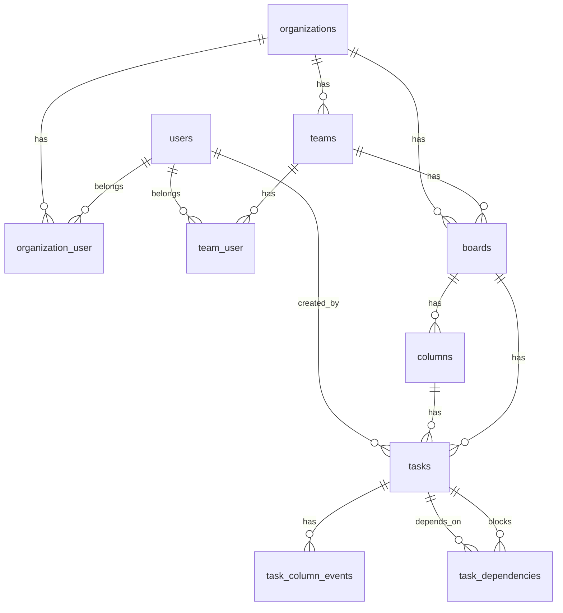

# KanAI (Laravel 11, PostgreSQL, Redis)

Production-oriented multi-tenant Kanban MVP for manufacturing/corporate workflows.

## Architecture overview
- **Tenancy:** Organization -> Teams -> Boards. All task/board queries are scoped by organization membership.
- **RBAC:** Org roles (`org_admin`) + team roles (`manager`, `team_lead`, `member`, `viewer`) with policy enforcement.
- **Kanban core:** Ordered columns with optional WIP limits and controlled task move service.
- **Auditability:** Every move writes `task_column_events` plus structured `activity_logs` records (actor, action, old/new values).
- **Security:** Auth via Breeze, CSRF, validation, route authorization.

## ERD (Mermaid)


## OpenAPI-like endpoints (MVP)
- `GET /boards` (auth) — list boards available to current user.
- `GET /boards/{board}` (auth, policy:view) — board detail with columns/tasks and URL filters (`q`, `column_id`, `include_archived`).
- `POST /tasks/{task}/move` (auth, policy:move) — body: `to_column_id: uuid`.
- `POST /tasks/{task}/archive` / `POST /tasks/{task}/unarchive` (auth, policy:update).
- `POST /tasks/{task}/attachments` (auth, policy:update, multipart upload).
- `GET /attachments/{attachment}/download` (auth, policy:view).

## Setup
```bash
cp .env.example .env
composer install
npm install
php artisan key:generate
php artisan migrate --seed
npm run build
php artisan serve
```

### PostgreSQL/Redis .env snippet
```env
DB_CONNECTION=pgsql
DB_HOST=db
DB_PORT=5432
DB_DATABASE=kanai
DB_USERNAME=kanai
DB_PASSWORD=secret

CACHE_STORE=redis
REDIS_HOST=redis
QUEUE_CONNECTION=redis
```

## Docker
```bash
docker compose up -d --build
docker compose exec app composer install
docker compose exec app npm install
docker compose exec app php artisan migrate --seed
```

## Demo accounts
- `admin@kanai.local` / `password`
- `member@kanai.local` / `password`

## MVP-first checklist
- [x] Multi-tenant org/team/board model
- [x] UUID identifiers
- [x] Breeze auth scaffold
- [x] RBAC service + board/task policies
- [x] Kanban columns + tasks + move flow
- [x] WIP limit enforcement with manager override
- [x] Dependency checks before moving to done
- [x] Task column transition events
- [x] Feature tests for key paths

## Next iterations backlog
- Milestones, checklist items, comments, attachments
- In-app/email notifications + queues
- Automation rules engine
- Metrics API (lead/cycle/throughput/CFD)
- Full audit log for all entities
- 2FA enablement (Fortify/Jetstream feature flag)


## Publish notes
- Added `Dockerfile` for reproducible PHP 8.3 + PostgreSQL runtime setup.
- Added a dedicated `queue` container in `docker-compose.yml` for async processing.
- Added activity logging for task moves in `activity_logs`.


## Long-term production evolution (10-year view)
- **Archive-first knowledge retention:** archived tasks remain searchable via URL filters (`include_archived=1&q=...`) so historical decisions (e.g., tool X vs Y) are discoverable years later.
- **Change traceability:** task movement, archiving, and attachment uploads are auditable through activity logs.
- **Documentation continuity:** files (procedures, photos, spreadsheets) stay linked to the task that introduced or changed process steps.
